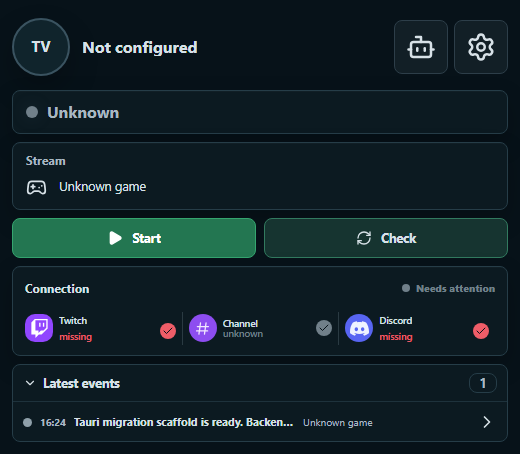

# TwitchAn

TwitchAn is a small Windows desktop app for Twitch stream monitoring, Discord notifications, and Twitch chat bot commands.

## Features

- Monitor a Twitch channel status from a compact desktop window.
- Send Discord webhook notifications when the stream goes online.
- Check Twitch, channel, and Discord setup from the main screen.
- Keep a local event log for stream checks, Discord delivery, and bot activity.
- Use a separate Twitch account as a chat bot.
- Create chat bot commands with regular expression triggers.
- Use response variables such as `{user}`, `{channel}`, `{args before}`, `{args after}`, and `{rand X to Y}`.
- Send timer-based bot messages to chat.
- Receive future updates through the built-in Tauri updater.

## Download

Download the latest Windows setup file from the [latest release](https://github.com/shishiawase/TwitchAn-releases/releases/latest).

Use the `TwitchAn_<version>_x64-setup.exe` asset. The `latest.json` and `.sig` files are updater metadata used by the app.

## Updating

Versions with updater support can check and install future updates from this public release channel.

Older builds without updater support must be replaced manually once by installing a newer setup file from Releases.

## Required Setup

TwitchAn needs your own Twitch application credentials to call Twitch APIs.

For Discord notifications, add a Discord webhook URL in the app settings.

For the chat bot, log in with the separate Twitch account that should send chat messages. The bot uses Twitch device-code login and stores bot authentication separately from the main app settings.

## Privacy

TwitchAn stores app settings locally on your PC. Secrets such as Twitch tokens and Discord webhook data are not published in this repository.

Do not share screenshots that reveal private webhook URLs, client secrets, or tokens.

---

## Disclaimer

TwitchAn is an independent, unofficial and experimental application. It is not affiliated with, endorsed by, sponsored by, or officially associated with Twitch, Discord, OBS Studio, Qwen, DeepSeek, or any of their respective owners. All product names, trademarks, and registered trademarks belong to their respective owners.

The application is provided **"as is"** and **"as available"**, without warranties of any kind, express or implied, including warranties of availability, reliability, accuracy, compatibility, security, merchantability, fitness for a particular purpose, and non-infringement. Use TwitchAn entirely at your own risk.

To the maximum extent permitted by applicable law, the author and contributors shall not be liable for account restrictions or bans, lost data, lost profits, service interruptions, failed or unintended commands, OBS actions, custom scripts, automated messages, AI-generated content, third-party service changes, or any other direct, indirect, incidental, special, consequential, or similar loss arising from the installation or use of TwitchAn.

TwitchAn depends on third-party platforms that may change, restrict, suspend, or discontinue access at any time. Their availability and compatibility are not guaranteed. Use of TwitchAn does not replace or override the terms, policies, licenses, or community guidelines of those services.

Users are solely responsible for:

- complying with applicable laws and third-party terms, policies, licenses, and rights;
- reviewing and controlling messages, commands, scripts, automations, and AI-generated output published through their accounts;
- obtaining any permissions or consents required to process or submit channel, viewer, chat, or other third-party data;
- protecting their credentials, browser sessions, configuration, and local data; and
- maintaining backups and verifying that configured actions are safe before using them on a live channel.

Browser AI may store authenticated browser-session data locally and may submit prompts, personalization, channel information, and chat context to the AI provider selected by the user. Do not enable Browser AI unless you understand and accept the selected provider's terms and privacy practices and have the rights and permissions required for the submitted data.

AI-generated output may be inaccurate, incomplete, offensive, or otherwise unsuitable. It must not be treated as professional, legal, medical, financial, or other authoritative advice.

By downloading, installing, or using TwitchAn, you acknowledge these risks and accept responsibility for your use of the application, except where applicable law does not permit such exclusions or limitations.

## License

MIT License. See [LICENSE](LICENSE).
